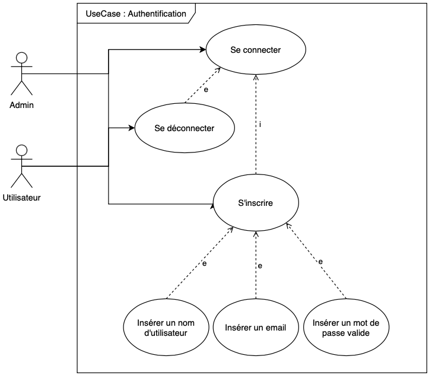
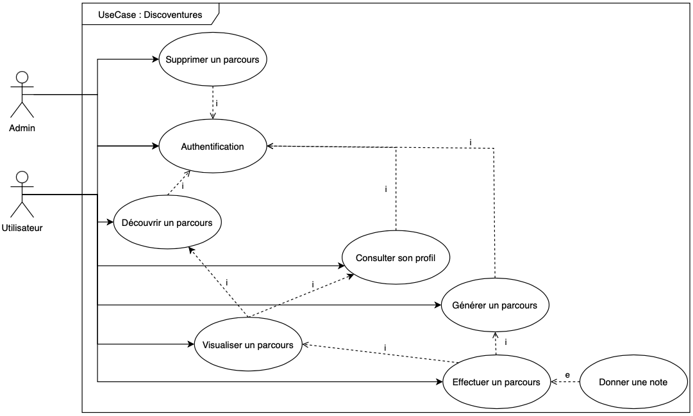
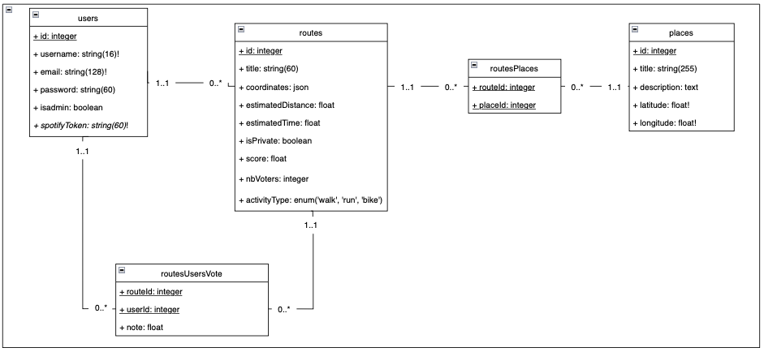
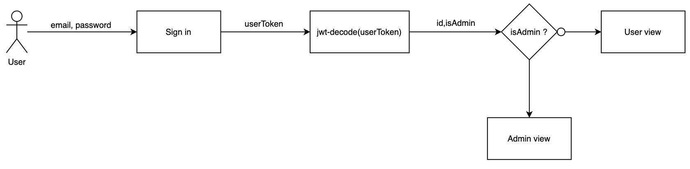

# Documentation du projet : Discoventures

# Sommaire 

1. [Objectifs du projet](#objectifs-du-projet)  
1.1 [Comment ?](#comment)  
1.2 [Demonstration](#demonstration)  
1.3 [Fonctionnailités manquantes](#fonctionnailités-manquantes)
2. [Prise en main du projet](#prise-en-main-du-projet)  
2.1 [Backend](#backend)  
2.2 [Frontend](#frontend)
3. [Scenarii](#scenarii)  
3.1 [S’inscrire](#sinscrire)  
3.2 [Se connecter](#se-connecter)  
3.3 [Générer un parcours](#générer-un-parcours)  
3.4 [Découvrir un parcours](#découvrir-un-parcours)    
3.5 [Consulter son profil](#Consulter-son-profil)   
3.6 [Visualiser un parcours](#Visualiser-un-parcours)  
3.7 [Effectuer un parcours](#effectuer-un-parcours)  
3.8 [Donner une note](#donner-une-note)  
3.9 [Se déconnecter](#se-déconnecter)  
3.10 [Supprimer un parcours](#supprimer-un-parcours)  
4. [Modèle de données](#modèle-de-données)  
4.1 [Association RoutesUsersVote](#Association-RoutesUsersVote)  
4.2 [Association routesPlaces](#association-routesplaces)  
4.3 [Users](#users)   
4.4 [Routes](#routes)  
4.5 [Places](#places)  
4.6 [RoutesUsersVote](#routesusersvote)  
4.7 [RoutesPlaces](#routesplaces)  
5. [Documentation API backend](#documentation-api-backend)
6. [Choix techniques](#choix-techniques)  
6.1 [Webservices](#webservices)  
6.2 [Librairies NPM](#librairiesnpm)  
6.3 [CI/CD](#cicd)  
6.4 [Architecture de l’application](#architecture-de-lapplication)  
6.4 [Gestion des rôles](#gestion-des-rôles) 

# Objectifs du projet

Discoventures est une application mobile pour tout sportif voulant se dépenser et explorer les horizons en marchant, en courant ou bien en faisant du vélo. L'objectif de cette application permet à chacun de générer un parcours aléatoire depuis sa position. Le parcours généré est pensé pour que l'utilisateur visite des lieux culturels et patrimoniaux durant son activité. Le parcours peut être partagé ou non pour les autres utilisateurs. La fonctionnalité phare de cette application est l'activation automatique d'un audio guide lorsque l'utilisateur passe devant ces lieux importants pour mieux les connaitre. A la fin d'un parcours, une note sur 5 peut lui être attribuée sous forme d'étoiles.

## Comment ?

En utilisant les cartes natives de IOS et Android, un tracé de parcours est affiché. Il est enrichie de lieux touristiques grâce à la <a href="https://data.culture.gouv.fr/pages/home/">banque de données du gouvernement français</a>. Nous pouvons nous déplacer vers ces lieux. A 50 mètres du lieu (calculé par la bibliothèque <a href="https://www.npmjs.com/package/geolib">geolib</a>), un guide audio nous dicte des informations concernant ce lieu avec le module <a href="https://docs.expo.dev/versions/latest/sdk/speech/">expo-speech</a>.

## Fonctionnailités manquantes

A cet instant, seul le système de notes n'est pas implémenté dans le frontend. Cependant, le backend est prêt à recevoir cette fonctionnalité.

## Demonstration

Une démonstration peut être visualisée <a href="https://youtu.be/nSQIBluzfJo">ici</a>.

**NB: Pour cette démonstration, la détection avec le lieux touristique est faite à une distance de 300 mètres. Cela a permis de s'assurer que l'implémentation fonctionne** 

# Prise en main du projet

## Backend

L’utilisation du backend est faite depuis le répertoire `./backendsqlite`.

Avant tout, il faut installer toutes les librairies dont le backend dépend. Pour cela, exécuter la commande :  

```bash
npm install
```

La gestion des données est réalisée à travers la base de données SQLite 3 à travers l’ORM Sequelize. Pour posséder un jeu de données fonctionnel il est nécessaire d’initialiser la base de données. Depuis le répertoire `./backendsqlite`, exécuter :

```bash
npm run updatedb
```

Pour lancer le serveur backend sur le port 3000 :  
 - en production : 

```bash
 npm run start
```

- en développement (sans initialisation de la base de données) : 

```bash
 npm run startdev
```

Les tests du backend sont lancés à travers npm run test. Les tests Jest sont lancés séquentiellement avec l’option `–runInBand` (transparent pour le développeur). 

Le backend est doté de Swagger, permettant de documenter tous les endpoints disponibles de l’API. Pour générer cette documentation : 

```bash
 npm run doc
```
Elle est ensuite disponible à l’adresse `localhost:3000/doc`.

Toutefois, il est possible d’installer les dépendances, de générer la documentation et d'initialiser la base de données avec :

```bash
npm run setup
```

## Frontend :

L’utilisation du frontend est faite depuis le répertoire `./frontend/Discoventures`.

Il est nécessaire d’installer tous les paquets dont dépend l’application. Pour cela, réaliser : 

```bash
npm install
```

L’application se lance avec expo sur le port `19006` : 

```bash
npx expo start --tunnel
```
 
Cette dernière option permet de se brancher sur un réseau commun entre la version web et mobile.  

**Attention, l’application mobile n’est pas fonctionnelle avec le serveur backend local (localhost:3000). Il faut le lancer avec le serveur distant hébergé sur Scalingo.**


# Scenarii

<p align="center">
</img>
</p>

<p align="center">
</img>
</p>

En ouvrant l’application, l’utilisateur est redirigé vers l’écran de connexion.

## S’inscrire

À travers un formulaire, l’utilisateur peut s’inscrire à l’aide de son adresse mail, un nom d’utilisateur, ainsi qu’un mot de passe.

## Se connecter

Si l’utilisateur possède déjà un compte, il peut se connecter en indiquant son adresse mail et son mot de passe.

## Générer un parcours

L’utilisateur peut générer un parcours. Pour cela, il renseigne le nom du parcours ainsi que le type d’activité qu’il veut effectuer parmi la marche à pied, la course à pied ou bien du vélo. Il indique aussi le nombre maximum de kilomètres qu’il souhaite parcourir. Il peut décider de garder ce parcours public ou privé. Une fois validée, l’utilisateur patiente jusqu’à ce qu’un parcours lui soit proposé. Il peut analyser le nombre de kilomètres proposés, le temps estimé ainsi qu’un rappel du type de l’activité. La principale fonctionnalité est qu’il peut visualiser sur une carte intéractive le tracé ainsi que les lieux touristiques proposés. Ils se distinguent sur la map par des points rouges. En effectuant un touché sur eux, il peut découvrir le nom du lieu à visiter.

Si le parcours lui plaît, il peut l’enregistrer pour l’effectuer plus tard ou bien recommencer la génération.

## Découvrir un parcours

Dans l’onglet Découvertes, l’utilisateur accède à un aperçu de tous les parcours publics générés par les utilisateurs. Un aperçu est représenté par une carte sur laquelle, l’utilisateur retrouve un résumé du parcours : 
- le titre
- le tracé sur un fond de carte image
- la distance
- le temps estimé
- le type de l’activité
- la note actuelle

## Consulter son profil

Dans l’onglet profil, un utilisateur peut visualiser son pseudonyme et tous ses parcours créés. Pour chaque parcours, un aperçu lui renseigne : 
- le titre
- la visibilité : privée ou publique
- le tracé sur un fond de carte image
- la distance
- le temps estimé
- le type de l’activité
- la note actuelle

Depuis cette page de profil il peut se déconnecter.

## Visualiser un parcours

En cliquant sur un aperçu d’un parcours, l’utilisateur peut le visualiser. Il a donc accès à une page où il peut naviguer sur une carte interactive pour voir le tracé du parcours et les lieux touristiques / culturels  proposés. Ces lieux sont représentés par des points rouges. En pressant un point, une indication concernant le nom du lieu est disponible.

## Effectuer un parcours

Lorsque l’utilisateur visualise le parcours, il peut l’effectuer. Au-dessus de la carte interactive, il peut soit revenir à la page Découvertes ou bien lancer le parcours. Dans ce cas, il peut se déplacer vers les lieux. Une fois un lieu atteint, un guide audio lui dicte des informations sur celui-ci. L’utilisateur peut mettre en pause le parcours et le reprendre. Une fois terminé, il peut appuyer sur le bouton stop.

## Donner une note

Une fois le parcours arrêté, l’utilisateur peut lui attribuer une note sur 5 étoiles en effectuant un toucher ou un swipe.

## Se déconnecter

Depuis son profil, l’utilisateur peut se déconnecter en appuyant sur le bouton prévu à cet effet. Il est redirigé vers la page de connexion.

## Supprimer un parcours

Un administrateur accède à une vue sur laquelle il peut visualiser son nom ainsi que l’ensemble des parcours. Un aperçu de chaque parcours est consultable à travers : 
- le titre
- la visibilité : privée ou publique
- le tracé sur un fond de carte image
- la distance
- le temps estimé
- le type de l’activité
- la note actuelle

L’administrateur peut supprimer le parcours en appuyant sur l'icône représentant une croix en rouge.
L’administrateur peut se déconnecter.

# Modèle de données

Pour gérer la persistence de nos données, nous avons utilisé l'ORM Sequelize. Il permet d'avoir un système de gestion de données par modèle objet. Plusieurs entités ont été pensées.

<p align="center">
</img>
</p>

Notre application possède trois tables principales : Users, Routes et Places ainsi que deux tables de jonction : routesUsersVote et routesPlaces.

Sur le schéma ci-dessus, les clés primaires sont soulignées, les champs unique ont un point d'exclamation (!) après leur type et les attributs nullable sont en italiques.
Association Users - Routes
Un utilisateur peut générer plusieurs parcours et un parcours n’a qu’un seul créateur.

## Association RoutesUsersVote  
Un utilisateur peut donner des votes à des parcours, une fois que le parcours a été réalisé. Un parcours peut avoir plusieurs votes.

## Association routesPlaces
Chaque parcours peut contenir plusieurs lieux culturels. Un lieu culturel peut être contenu dans plusieurs parcours.

## Users
Un utilisateur est caractérisé par son email, son mot de passe qui est encodé avec une clé de hachage, son pseudo. Il est doté de l'information indiquant s'il est administrateur. De plus, l'objectif est de garder en mémoire ses jetons d'accès aux applications de musiques qu'il couple (fonctionnalité à développer).

## Routes
Un parcours est caractérisé par : 
un titre entré par l’utilisateur
ses coordonnées de géolocalisation (ensemble de points (longitude, latitude))
la distance estimé pour le parcourir
le temps estimé pour le parcourir
la visibilité du parcours au sein de la plateforme (privée ou publique)
le score (moyenne calculée par rapport aux votes d’utilisateur)
le nombre de votants
le type d’activité du parcours (de la marche, de la course, du vélo)

## Places
Le lieu culturel est caractérisé par son nom, une description succincte et sa position géographique.

## RoutesUsersVote
Cette table stocke tous les votes effectués par un utilisateur pour un parcours. Un utilisateur ne peut voter qu’une fois pour un parcours qu’il a terminé et ne peut pas modifier son vote.
Le vote peut aller entre 0 à 5.

## RoutesPlaces
Cette table relie chaque lieu culturel aux parcours qui le contiennent.

# Documentation API backend

La documentation se trouve<a href="https://discoventures.osc-fr1.scalingo.io/doc/"> ici</a>.

# Choix techniques

Ce projet s'appuie sur de nombreux choix techniques. Des librairies NPM et des API externes sont utilisées. Une chaîne de développement continue a été mise en place. 

## Webservices

Plusieurs Webservices REST sont utilisés dans le projet :

<a href="https://docs.mapbox.com/api/maps/static-images/">Mapbox (Static Image API)</a> : cette API permet de visualiser le tracé d’un parcours sur un fond de carte miniature. 

*Utilisation*

Cette API est utilisé dans le composant MapCard. Elle permet d’afficher l’image du parcours.

<a href="https://data.culture.gouv.fr/pages/home/">data.culture.gouv.fr</a> : il s’agit d’une base de données donnant des sites, des lieux et des équipements culturels dans toute la France ou bien selon notre position.

*Utilisation*

Cette API est utilisé dans le composant GenerateParcoursForm. Elle permet de récupérer tous les lieux touristiques lors de la génération du parcours.

<a href="https://www.mediawiki.org/wiki/MediaWiki">Mediawiki</a> : API permettant de retrouver les informations issues de Wikipédia à propos d’une recherche. Dans notre cas, les données récupérées de data.culture.gouv.fr sont utilisées dans Mediawiki pour accéder à une description du lieu.

*Utilisation*

Cette API est utilisé dans le composant GenerateParcoursForm. Elle permet de récupérer toutes les description des lieux touristiques/culturels choisis.

## Librairies NPM

### Lecture à haute voix:

<a href="https://docs.expo.dev/versions/latest/sdk/speech/">expo-speech</a> : Ce module expo permet d'utiliser le composant natif du telephone pour dicter du contenu écrit à haute voix.

### Maps : 
<a href="https://github.com/react-native-maps/react-native-maps">react-native-maps</a> : utilisation des cartes natives pour la visualisation des tracés et des lieux touristiques. Sur IOS, Apple Plans est utilisé. Sur Android, il s’agit de Google Maps.  

<a href="https://www.npmjs.com/package/@googlemaps/polyline-codec">googlemaps/polyline-codec</a> : Dans le profil de l’utilisateur et pour la recherche des parcours disponibles, nous devons visualiser un aperçu du parcours. Pour cela, l’API Static Image de Mapbox permet de fournir une image “fond de carte” afin d’y ajouter le tracé. Ce tracé est composé d’un ensemble de points latitude/longitude qui doit être encodé selon <a href="https://developers.google.com/maps/documentation/utilities/polylinealgorithm?hl=fr">l’algorithme de Google</a>. 

### GPS & Coordonnées

<a href="https://docs.expo.dev/versions/latest/sdk/location/">expo-location</a> : Ce module permet d'utiliser le composant GPS du téléphone. 

<a href="https://www.npmjs.com/package/geolib">geolib</a> : Cette vibliothèque permet de connaitre la distance restante entre notre position et celle du lieux touristique.


### Navigation & données:
<a href="https://reactnavigation.org">react-navigation</a> : Pour se déplacer au sein de l’application, cette librairie est la référence de react-native. Ceci permet de mettre en place les différents flows d'authentification mais aussi de navigation à travers une barre de navigation.  

<a href="https://redux.js.org/introduction/getting-started">redux</a> : cette bibliothèque gère l’état de l’application. Ceci permet de garder en mémoire des données tout au long de l’utilisation de l’application jusqu’à la déconnexion de l’utilisateur. Dans notre cas, elle permet de stocker le nom d’utilisateur, son token, son email, son statut (utilisateur simple ou admin) ainsi que son id. Ces données sont récupérées facilement depuis n’importe quel composant.  

<a href="https://www.npmjs.com/package/jwt-decode">jwt-decode</a> : lorsque l’application récupère le token d’un utilisateur, cette bibliothèque permet de le décoder et de connaître ses droits ainsi que son identifiant.

### Styles :
<a href="https://docs.expo.dev/versions/latest/sdk/font">expo-font</a> : notre application contient des fichiers de polices d’écritures personnalisées. Ce paquet permet de les charger et de les rendre disponibles à l’utilisation.  

<a hre="https://www.react-native-material.com/docs/getting-started">react-native-material-core</a> : bibliothèque graphique pour utiliser des composants selon nos besoins.

### Tests :
<a href="https://jestjs.io/fr/docs/getting-started">Jest</a>: Le backend est entièrement testé avec la librairie Javascript Jest.   

<a href="https://www.cypress.io">Cypress </a> : cet outil permet de faire des tests de l’interface utilisateurs.

### Votes : 
<a href="https://www.npmjs.com/package/react-native-star-rating-widget">react-native-star-rating-widget</a> : des étoiles interactives permettent de mettre une note sur un parcours en effectuant un swipe ou un toucher 

### Analyseur statique :
<a href="https://eslint.org/docs/latest/">eslint</a>: pour contrôler la syntaxe du backend et du frontend cette analyseur syntaxique permet de garder une cohérence dans l’écriture des fichiers de code. Il est paramétré selon nos besoins.

## CI/CD

Pour mener à bien le développement de notre application, une chaine d'intégration et de développement continue a été mise en place. 5 étapes ont eté créées :  

1. Analyse syntaxique du code
2. Exécution des tests
3. Documentation
4. Déploiement
5. Production

### Analyse syntaxique du code

L'objectif de cette étape est de contrôler la qualité du code écrit. Pour cela un linter spécifique pour react a été choisi.

### Exécution des tests

Lorsque du code est poussé sur le dépôt, il est important d'analyser si notre code régresse. Pour cela une étape exécute les tests du frontend (cypress) ainsi que du backend(Jest). Au moindre échec le code n'est pas poussé. De même lorsqu'une tentative de fusion de branche est réalisée.

### Documentation

Lorsque les tests sont passés, une génération de la documentation du backend a lieu avec Swagger. Même si elle n’est pas récupéré cela permet de détecter d’éventuelles erreurs si la commande npm run doc n’a pas été exécutée par le développeur avant de pousser le code.

### Déploiement
Notre backend doit être disponible sur le cloud. Cette étape permet d'envoyer notre API interne sur un dépôt distant Scalingo afin de rendre disponible les points d'accès de notre API depuis une adresse accessible de l'extérieur.

### Production
Enfin, la dernière étape a pour objectif de packager l'application et de créer l'exécutable Android. Un artefact est créé, l’APK peut être téléchargée.

## Architecture de l’application

### Backend

Le cœur de notre serveur backend se trouve dans le dossier src/. C’est une architecture qui suit le modèle MVC (modèle-vue-contrôleur).

**Modèles** `(dossier /models)`

À chaque table de notre modèle de données est associé un fichier dans lequel est décrit la liste de ses attributs ainsi que les différentes associations qu’il peut avoir avec d’autres tables.
Il y a également le fichier de configuration database.js de notre base de données qui est présent dans ce dossier.

**Vues** (dans le projet `/frontend/Discoventures`)

Nous gérons les vues dans le projet frontend.

**Endpoints API** `(dossier /routes)`

Chaque endpoint est susceptible de passer par des middlewares avant d’exécuter la fonction présent dans le contrôleur associé.
Un fichier par base de chemin différent est créé.

**Middlewares** (dossier `/middlewares`)

Les middlewares sont découpés par concept. Par exemple, toutes les vérifications liées au token se trouvent dans `/middleware/token.js` et celles pour les parcours se trouvent dans `/middleware/route.js`.

**Contrôleurs** `(dossier /controllers)`

Comme précédemment, nous avons un contrôleur par concept. Toute la logique de ce que renvoie nos endpoints se trouve ici. C’est aussi dans ces fichiers qu’on documente notre API avec Swagger.

**Tests API** `(dossier /__tests__)`

Tous nos tests API sont faits avec supertest et Jest.
Un fichier de test par route différente. Avant chaque lancement, on réinitialise la base de données à vide et on crée les données qui nous intéressent pour nos tests dans beforeAll().

### Frontend

**Redux** `(dossier /app)`

Dans cette structure, nous retrouvons la configuration de Redux pour React-native. Dans `/app/slices`, deux slices sont présents. Un slice caractérise un utilisateur pour stocker ses données tout au long de l’utilisation de l’application jusqu’à la déconnexion. La seconde entité représente une activité pour connaître son type lors de la génération du parcours.

Ces deux entités sont rattachées au fichier `/app/store/stores.js` qui permet d’enregistrer les précédentes slices. Elles sont appelées “reducer”.

**Assets** `(dossier /assets)`

On y trouve les éléments de style de notre application : des images statiques comme la favicon, le splash screen et l’icône de l’application et les deux fonts utilisées (.ttf).

**Tests E2E** `(dossier /cypress)`

Tous les fichiers liés à nos tests cypress sont répertoriés ici.
On trouve dans le sous dossier /e2e, les fichiers de tests end-to-end réalisés sur notre application en version web.

Le coeur de notre application front-end se trouve dans le dossier /src

**Cosmétique** `(dossier /style)`

Le fichier colors.js regroupe toute la palette graphique de notre application.
Le fichier fonts.js regroupe l’ensemble des fonts utilisables dans notre application.
Cela permet d’harmoniser et de maintenir une cohérence de style grâce à des variables réutilisables dans tous nos fichiers.
C’est un dossier qui est évoluable dans la mesure où nous pouvons l’agrémenter d’autres fichiers qui peuvent servir à harmoniser d’autres éléments de style (flex, spacing …).

**Fonctions réutilisables** `(dossier /utils)`

Nous mettons toutes les fonctions utilitaires susceptibles d’être réutilisées. Cela permet également d’isoler les fonctions et de pouvoir les tester unitairement avec Cypress.

**Pages de l’application** `(dossier /views)`

Ce sont les vues principales de l’application entre lesquelles l’utilisateur peut naviguer dans l’application. On a décidé de séparer les pages en trois dossiers différents par rapport aux droits de l'utilisateur. Ensuite, les pages sont répertoriées dans un dossier à leur nom.

*Administrateur* `(sous-dossier /admin)`

Toutes les pages disponibles seulement pour les administrateurs.

*Communs* `(sous-dossier /common)`

Toutes les pages disponibles pour tous les utilisateurs (admin ou user).

*Utilisateurs* `(sous-dossier /user)`

Toutes les pages disponibles seulement pour les utilisateurs.

**Composants** `(dossier /components)`

On répertorie tous les composants de notre application ici.  

*UIKit* `(sous-dossier /uikit)`

Nos plus petits éléments d’UIKit.

*Navigation* `(sous-dossier /navigation)`

Les fichiers permettant de naviguer entre les vues.


## Gestion des rôles
<p align="center">
</a>
</p>

Au sein de l’application, deux types d’utilisateurs sont présents. Nous retrouvons l’entité qui utilise l’application (utilisateurs) et l’entité qui gère l’application (administrateur). La gestion de ces deux rôles se fait au moment de la connexion. Lorsque l’utilisateur se connecte, le endpoint /login renvoie le token de l’utilisateur. Une fois décodé, il est possible de connaître son id et surtout son statut à travers la données isAdmin. Si celle-ci détient la valeur true, il s’agit d’un administrateur qui sera redirigé vers une vue spécifique. Dans ce cas, il peut gérer les parcours de l’application en les supprimant. Dans le cas contraire, il s’agit d’un utilisateur simple qui a accès à l’ensemble des fonctionnalités de l’application.


