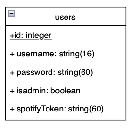

# Documentation du projet

# Objectifs du projet

Discoventures est une application mobile pour tout sportif voulant se dépenser en explorant les horizons. L'objectif de cette application permet à chacun de générer un parcours aléatoire depuis une position de départ. Le parcours généré est pensé pour que l'utilisateur visite des lieux culturels et patrimoniaux durant son activité. La fonctionnalité phare de cette application est l'activation automatique d'un audio guide lorsque l'utilisateur passe devant ces lieux importants. En liant son application de musiques en streaming, son activité pourra s'effectuer en écoutant ses playlists préférées.

# Cas d'usage

- S'inscrire

- Se connecter

- Lier son compte de musiques en streaming

- Générer un parcours

- Enregistrer le parcours

- Visualiser son profil

- Démarrer le parcours (activité)

- Terminer l'activité

- Enregistrer l'activité

- Rechercher les parcours publics

- [administrateur] Supprimer des utilisateurs

- [administrateur] Supprimer des parcours dangereux

# Scenarii d'usage

## S'inscrire

## Se connecter

Un utilisateur arrive sur la page de connexion. Il doit saisir son adresse mail ainsi que son mot de passe. Si l'un des deux champs saisis est erroné, un message d'erreur s'affiche de manière voyante (message en rouge). Si l'utilisateur n'a pas de compte, il peut s'inscrire en cliquant sur le lien prévu à cet effet.

## Lier son compte de musiques en streaming

## Générer un parcours

## Enregistrer le parcours

## Visualiser son profil

## Démarrer le parcours (activité)

## Terminer l'activité

## Enregistrer l'activité

## Rechercher les parcours publics

## [administrateur] Supprimer des utilisateurs

## [administrateur] Supprimer des parcours dangereux

# Modèle de données

Pour gérer la persistence de nos données, nous avons utilisé l'ORM Sequelize. Il permet d'avoir un système de gestion de données par modèle objet. Plusieurs entités ont été "designées".

## Sequelize

### Utilisateurs

Un utilisateur est caractérisé par son email, son mot de passe qui est encodé avec une clé de hachage, son pseudo. Il est doté de l'information indiquant s'il est administrateur. De plus, l'objectif est de garder en mémoire ses jetons d'accès aux applications de musiques qu'il couple.

</img>

| Attributs        | Clé primaire   | Clé étrangère  | Type           | Unique         | Null          |
| :--------------- |:---------------|:---------------|:---------------|:---------------|:--------------|
| id               |x               |                |  Integer       |                |               |
| username         |                |                |  String        |x               |               |
| email            |                |                |  String        |x               |               |
| password         |                |                |  String        |                |               |
| isadmin          |                |                |  Boolean       |                |               |
| spotifyToken     |                |                |  String        |x               |x              |

### Parcours

A voir si on garde GPX ou codé.

### Lieux

Cette entité est alimentée par une API externe répertoriant tous les lieux culturels et patrimoniaux autour de l'utilisateur. Pour un parcours données, cela permet de connaître tous ses lieux importants. Une information très utile pour activer l'audio guide et d'informer les autres utilisateurs.

### Activités

A voir si on garde GPX ou codé.

## API externes

### Lieux culturels/patrimoniaux

### Musiques streaming

### API guide touristique

Dicter avec logiciel + Lecture Wikipedia ??

# Documentation de l'API interne

Lien Swagger

# Choix techniques

- typescript

- mui

- font

## CI/CD

Pour mener à bien le développement de notre application, une chaine d'intégration et de développement continue a été mise en place. 6 étapes ont eté créées :  

1. Analyse syntaxique du code
2. Exécution des tests
3. Documentation
4. Déploiement
5. Badge
6. Production

### Analyse syntaxique du code

L'objectif de cette étape est de contrôler la qualité du code écrit. Pour cela un linter spécifique pour react a été choisi.

### Exécution des tests

Lorsque du code est poussé sur le dépôt, il est important d'analyser si notre code régresse. Pour cela une étape exécute les tests du frontend ainsi que du backend. Au moindre échec le code n'est pas poussé. De même lorsqu'une tentative de fusion de branche est réalisée.

### Documentation

Lorsque les tests sont passé, une génération de la documentation du backend a lieu avec Swagger.

### Déploiement

Notre backend doit être disponible sur le cloud. Cette étape permet d'envoyer notre API interne sur un dépôt distant Scalingo afin de rendre disponible les points d'accès de notre API depuis une adresse accessible de l'extérieur.
### Badge

Les badges sont utiles pour avoir des indicateurs sur la page principale du dépôt. Nous devons savoir si les tests passes, ainsi que des informations sur la qualité du code en continue.

### Production

Enfin, la dernière étape a pour objectif de packager l'application et de créer l'exécutable Android.

## Webservices

## Gestion des rôles

A décrire

- Créateur d'un parcours
- Pratiquant du parcours

(Créateur et pratiquant => pareil)

- Administrateur

## Architecture de l'application

-> router
-> component

# Screencast

# Autres éléments
