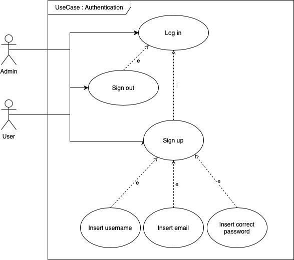

# Project documentation: Discoventures

# Summary 

1. [Project goals](#project-goals)  
1.1 [How ?](#how)  
1.2 [Demonstration](#demonstration)  
1.3 [Missing features](#missing-features)
2. [Getting started with the project](#getting-started-with-the-project)  
2.1 [Backend](#backend)  
2.2 [Frontend](#frontend)
3. [Scenarii](#scenarii)  
3.1 [Register](#register)  
3.2 [Log in](#log-in)  
3.3 [Generate a route](#generate-a-route)  
3.4 [Discover a route](#discover-a-route)    
3.5 [View their profile](#view-their-profile)   
3.6 [View a route](#view-a-route)  
3.7 [Complete a route](#complete-a-route)  
3.8 [To give a note](#to-give-a-note)  
3.9 [Sign out](#sign-out)  
3.10 [Delete a course](#delete-a-course)  
4. [Data model](#data-model)  
4.1 [Association RoutesUsersVote](#Association-RoutesUsersVote)  
4.2 [Association routesPlaces](#association-routesplaces)  
4.3 [Users](#users)   
4.4 [Routes](#routes)  
4.5 [Places](#places)  
4.6 [RoutesUsersVote](#routesusersvote)  
4.7 [RoutesPlaces](#routesplaces)  
5. [Documentation API backend](#documentation-api-backend)
6. [Technical choices](#technical-choices)  
6.1 [Webservices](#webservices)  
6.2 [NPM Libraries](#npmlibraries)  
6.3 [CI/CD](#cicd)  
6.4 [Application architecture](#application-architecture)  
6.4 [Role management](#role-management) 

# Project goals

Discoventures is a mobile application for any athlete wanting to exercise and explore the horizons by walking, running or cycling. The objective of this application allows everyone to generate a random route from their position. The generated route is designed so that the user visits cultural and heritage places during their activity. The route may or may not be shared with other users. The flagship feature of this application is the automatic activation of an audio guide when the user passes these important places to get to know them better. At the end of a course, a rating out of 5 can be given to it in the form of stars.

## How ?

Using native IOS and Android maps, a route map is displayed. It is enriched with tourist places thanks to the <a href="https://data.culture.gouv.fr/pages/home/">French government data bank</a>. We can travel to these places. 50 meters from the location (calculated by the library <a href="https://www.npmjs.com/package/geolib">geolib</a>), an audio guide dictates information about this location to us with the module <a href="https://docs.expo.dev/versions/latest/sdk/speech/">expo-speech</a>.

## Missing features

At this moment, only the notes system is not implemented in the frontend. However, the backend is ready to receive this functionality.

## Demonstration

A demonstration can be viewed <a href="https://youtu.be/nSQIBluzfJo">here</a>.

**NB : For this demonstration, the detection with the tourist places is done at a distance of 300 meters. This ensured that the implementation worked** 

# Getting started with the project

## Backend

The use of the backend is done from the directory `./backendsqlite`.

First of all, you must install all the libraries on which the backend depends. To do this, execute the command: 

```bash
npm install
```

Data management is carried out through the SQLite 3 database through the Sequelize ORM. To have a functional dataset it is necessary to initialize the database. From directory `./backendsqlite`, execute :

```bash
npm run updatedb
```

To launch the backend server on port 3000:
 - in production : 

```bash
 npm run start
```

 - in development (without database initialization):

```bash
 npm run startdev
```

Backend tests are run through npm run test. Jest tests are run sequentially with the `–runInBand` option (transparent to the developer).

The backend is equipped with Swagger, allowing you to document all available endpoints of the API. To generate this documentation: 

```bash
 npm run doc
```
It is then available at `localhost:3000/doc`.

However, it is possible to install the dependencies, generate the documentation and initialize the database with:

```bash
npm run setup
```

## Frontend :

The frontend is used from the directory `./frontend/Discoventures`.

It is necessary to install all the packages on which the application depends. To do this, carry out:

```bash
npm install
```

The application launches with expo on port `19006`:

```bash
npx expo start --tunnel
```
 
This last option allows you to connect to a common network between the web and mobile version.

**Please note, the mobile application is not functional with the local backend server (localhost:3000). It must be launched with the remote server hosted on Scalingo.**


# Scenarii

<p align="center">
</img>
</p>

<p align="center">
</img>
</p>

Upon opening the app, the user is redirected to the login screen.

## Register

Through a form, the user can register using their email address, a username, and a password.

## Log in

If the user already has an account, they can log in by providing their email address and password.

## Generate a route

The user can generate a route. To do this, he enters the name of the route as well as the type of activity he wants to carry out: walking, running or cycling. He also indicates the maximum number of kilometers he wishes to travel. He can decide to keep this route public or private. Once validated, the user waits until a route is offered to them. It can analyze the number of kilometers proposed, the estimated time as well as a reminder of the type of activity. The main functionality is that it can display the route as well as the tourist places offered on an interactive map. They are distinguished on the map by red dots. By touching them, he can discover the name of the place to visit.

If he likes the route, he can save it to do it later or start the generation again.

## Discover a route

In the Discoveries tab, the user accesses an overview of all public user-generated journeys. An overview is represented by a map on which the user finds a summary of the route:
- the title
- the plot on an image map background
- the distance
- the estimated time
- the type of activity
- the current rating

## View their profile

In the profile tab, a user can view their nickname and all their created routes. For each route, an overview provides information:
- the title
- visibility: private or public
- the plot on an image map background
- the distance
- the estimated time
- the type of activity
- the current rating

From this profile page he can log out.

## View a route

By clicking on a preview of a route, the user can view it. He therefore has access to a page where he can navigate on an interactive map to see the route of the route and the tourist/cultural places offered. These places are represented by red dots. By pressing a dot, an indication of the location name is available.

## Complete a route

When the user views the route, they can complete it. Above the interactive map, you can either return to the Discoveries page or start the route. In this case, he can move to the location. Once you reach a location, an audio guide dictates information about it. The user can pause the course and resume it. Once finished, he can press the stop button.

## To give a note

Once the route is stopped, the user can give it a rating out of 5 stars by tapping or swiping.

## Sign out

From their profile, the user can log out by pressing the button provided for this purpose. He is redirected to the login page.

## Sign out

From their profile, the user can log out by pressing the button provided for this purpose. He is redirected to the login page.

## Delete a course

An administrator accesses a view in which he can view his name as well as all the routes. An overview of each route can be viewed through:
- the title
- visibility: private or public
- the plot on an image map background
- the distance
- the estimated time
- the type of activity
- the current rating

The administrator can delete the course by tapping the red cross icon.
The administrator can log out.

# Data model

To manage the persistence of our data, we used the Sequelize ORM. It allows you to have a data management system using an object model. Several entities have been thought of.

<p align="center">
</img>
</p>

Our application has three main tables: Users, Routes and Places as well as two junction tables: routesUsersVote and routesPlaces.

In the diagram above, primary keys are underlined, unique fields have an exclamation point (!) after their type, and nullable attributes are italicized.
Users Association - Routes
A user can generate several courses and a course has only one creator.

## RoutesUsersVote Association
A user can give votes to courses, once the course has been completed. A course can have several votes.

##RoutesPlaces Association
Each route can contain several cultural places. A cultural place can be contained in several routes.

##Users
A user is characterized by his email, his password which is encoded with a hash key, his nickname. It is provided with the information indicating whether he is an administrator. In addition, the objective is to keep in memory its access tokens to the music applications that it pairs (functionality to be developed).

## Routes
A course is characterized by:
a title entered by the user
its geolocation coordinates (set of points (longitude, latitude))
the estimated distance to travel it
the estimated time to complete it
visibility of the journey within the platform (private or public)
the score (average calculated in relation to user votes)
the number of voters
the type of activity of the route (walking, running, cycling)

## Places
The cultural place is characterized by its name, a brief description and its geographical position.

## RoutesUsersVote
This table stores all the votes made by a user for a course. A user can only vote once for a course they have completed and cannot change their vote.
The vote can go from 0 to 5.

## RoutesPlaces
This table links each cultural place to the routes that contain it.

# Documentation API backend

The documentation can be found<a href="https://discoventures.osc-fr1.scalingo.io/doc/">here</a>.

# Technical choices

This project is based on numerous technical choices. NPM libraries and external APIs are used. A continuous development chain has been put in place.

## Webservices

Several REST Webservices are used in the project:

<a href="https://docs.mapbox.com/api/maps/static-images/">Mapbox (Static Image API)</a>: this API allows you to visualize the layout of a route on a background miniature map.

*Use*

This API is used in the MapCard component. It allows you to display the image of the route.

<a href="https://data.culture.gouv.fr/pages/home/">data.culture.gouv.fr</a>: this is a database giving sites, places and cultural facilities throughout France or depending on our location.

*Use*

This API is used in the GenerateParcoursForm component. It allows you to retrieve all tourist places when generating the route.

<a href="https://www.mediawiki.org/wiki/MediaWiki">Mediawiki</a>: API allowing you to find information from Wikipedia about a search. In our case, the data retrieved from data.culture.gouv.fr is used in Mediawiki to access a description of the location.

*Use*

This API is used in the GenerateParcoursForm component. It allows you to retrieve all the descriptions of the chosen tourist/cultural places.

## NPM Libraries

### Read aloud:

<a href="https://docs.expo.dev/versions/latest/sdk/speech/">expo-speech</a>: This expo module allows you to use the native component of the phone to dictate written content aloud.

### Maps:
<a href="https://github.com/react-native-maps/react-native-maps">react-native-maps</a>: use of native maps for visualizing routes and tourist locations. On IOS, Apple Maps is used. On Android, this is Google Maps.

<a href="https://www.npmjs.com/package/@googlemaps/polyline-codec">googlemaps/polyline-codec</a>: In the user profile and to search for available routes, we need to visualize an overview of the route. For this, the Mapbox Static Image API allows you to provide a “base map” image in order to add the route. This plot is composed of a set of latitude/longitude points which must be encoded according to the <a href="https://developers.google.com/maps/documentation/utilities/polylinealgorithm?hl=fr">algorithm Google</a>.

### GPS & Coordinates

<a href="https://docs.expo.dev/versions/latest/sdk/location/">expo-location</a>: This module allows you to use the GPS component of the phone.

<a href="https://www.npmjs.com/package/geolib">geolib</a>: This library allows us to know the remaining distance between our position and that of the tourist location.


### Navigation & data:
<a href="https://reactnavigation.org">react-navigation</a>: To move around within the application, this library is the react-native reference. This makes it possible to set up the different authentication flows but also navigation through a navigation bar.

<a href="https://redux.js.org/introduction/getting-started">redux</a>: This library manages the state of the application. This allows data to be stored in memory throughout the use of the application until the user logs out. In our case, it allows you to store the user name, its token, its email, its status (single user or admin) as well as its id. This data is easily retrieved from any component.

<a href="https://www.npmjs.com/package/jwt-decode">jwt-decode</a>: when the application retrieves a user's token, this library allows it to be decoded and know your rights as well as your identifier.

### Styles:
<a href="https://docs.expo.dev/versions/latest/sdk/font">expo-font</a>: our application contains custom font files. This package allows them to be loaded and made available for use.

<a hre="https://www.react-native-material.com/docs/getting-started">react-native-material-core</a>: graphics library to use components according to our needs.

### Tests:
<a href="https://jestjs.io/fr/docs/getting-started">Jest</a>: The backend is fully tested with the Jest Javascript library.

<a href="https://www.cypress.io">Cypress </a>: this tool allows you to test the user interface.

### Votes:
<a href="https://www.npmjs.com/package/react-native-star-rating-widget">react-native-star-rating-widget</a>: interactive stars allow you to rate on a course by swiping or tapping

### Static analyzer:
<a href="https://eslint.org/docs/latest/">eslint</a>: to control the syntax of the backend and frontend this syntactic analyzer allows you to maintain consistency in the writing of code files . It is configured according to our needs.

## CI/CD

To successfully complete the development of our application, a continuous integration and development chain has been set up. 5 steps have been created:

1. Code parsing
2. Running tests
3. Documentation
4. Deployment
5. Production

### Code parsing

The objective of this step is to control the quality of the written code. For this a specific linter for react was chosen.

### Running tests

When code is pushed to the repository, it is important to analyze whether our code regresses. To do this, one step runs the frontend (cypress) and backend (Jest) tests. At the slightest failure the code is not pushed. Likewise when a branch merge attempt is made.

### Documentation

When the tests are passed, a generation of the backend documentation takes place with Swagger. Even if it is not retrieved, this allows possible errors to be detected if the npm run doc command was not executed by the developer before pushing the code.

### Deployment
Our backend must be available on the cloud. This step allows us to send our internal API to a remote Scalingo repository in order to make the access points of our API available from an address accessible from the outside.

### Production
Finally, the last step aims to package the application and create the Android executable. An artifact is created, the APK can be downloaded.

## Architecture application

### Backend

The heart of our backend server is located in the src/ folder. It is an architecture that follows the MVC (model-view-controller) pattern.

**Models** `(folder /models)`

Each table in our data model is associated with a file in which the list of its attributes is described as well as the different associations it can have with other tables.
There is also the database.js configuration file of our database which is present in this folder.

**view** `(/frontend/Discoventures)`

We manage views in the frontend project.

**Endpoints API** `(folder /routes)`

Each endpoint is likely to go through middleware before executing the function present in the associated controller.
A file per different path base is created.

**Middlewares** (folder `/middlewares`)

Middlewares are divided by concept. For example, all token-related checks are in `/middleware/token.js` and those for routes are in `/middleware/route.js`.


**Contrôleurs** `(folder /controllers)`

As before, we have one controller per concept. All the logic of what our endpoints return can be found here. It is also in these files that we document our API with Swagger.

**Tests API** `(folder /__tests__)`

All our API tests are done with supertest and Jest.
One test file per different route. Before each launch, we reset the database to empty and we create the data that interests us for our tests in beforeAll().

### Frontend

**Redux** `(folder /app)`

In this structure, we find the Redux configuration for React-native. In `/app/slices`, two slices are present. A slice characterizes a user to store their data throughout the use of the application until disconnection. The second entity represents an activity to know its type when generating the route.

These two entities are attached to the `/app/store/stores.js` file which allows you to save previous slices. They are called “reducer”.

**Assets** `(folder /assets)`

There we find the style elements of our application: static images such as the favicon, the splash screen and the application icon and the two fonts used (.ttf).

**Tests E2E** `(folder /cypress)`

All files related to our cypress tests are listed here.
We find in the /e2e subfolder the end-to-end test files carried out on our application in web version.

The heart of our front-end application is located in the /src folder

**Cosmetic** `(dossier /style)`

The colors.js file brings together the entire graphic palette of our application.
The fonts.js file brings together all the fonts that can be used in our application.
This makes it possible to harmonize and maintain style consistency thanks to reusable variables in all our files.
It is a file that is scalable to the extent that we can enhance it with other files that can be used to harmonize other style elements (flex, spacing, etc.).

**Reusable functions** `(folder /utils)`

We put all the utility functions that can be reused. This also makes it possible to isolate functions and be able to test them individually with Cypress.

**Application pages** `(/views folder)`

These are the main views of the application that the user can navigate between within the application. We decided to separate the pages into three different folders based on user rights. Then the pages are listed in a folder with their name.

*Administrator* `(subfolder /admin)`

All pages available only for administrators.

*Commons* `(subfolder /common)`

All pages available for all users (admin or user).

*Users* `(subfolder /user)`

All pages available only for users.

**Components** `(folder /components)`

We list all the components of our application here.

*UIKit* `(subfolder /uikit)`

Our smallest elements of UIKit.

*Navigation* `(subfolder /navigation)`

Files used to navigate between views.


## Role management
<p align="center">
</a>
</p>

Within the application, two types of users are present. We find the entity that uses the application (users) and the entity that manages the application (administrator). These two roles are managed at connection time. When the user logs in, the /login endpoint returns the user's token. Once decoded, it is possible to know its ID and especially its status through the isAdmin data. If this is true, this is an administrator who will be redirected to a specific view. In this case, it can manage the application paths by deleting them. Otherwise, it is a simple user who has access to all of the application's functionalities.


